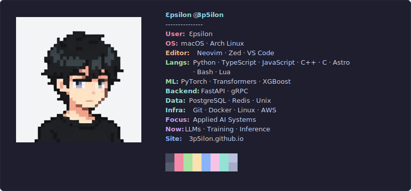

# ProfileFetch

A pixel-perfect, fully dynamic fastfetch style SVG generator for your GitHub Profile README.



## Setup

To set this up as a beautiful dashboard for your own GitHub global profile, use this codebase as a template:

1. **Fork or Template:** Click the **Use this template** button (or fork this repo) to your personal account.
2. **Customize Your Profile:** 
   * Edit `src/config.js` to change your data streams.
   * Edit `src/ascii.txt` to drop in your custom ascii art.
   * Edit `src/theme.js` to tweak styling and color palettes.
3. **Generate:** Run the core engine to build your scalable SVG.
   ```bash
   node src/generate.js
   ```

## Adding to your Profile README

In your special GitHub profile repository (`YOUR_USERNAME/YOUR_USERNAME`), embed the produced SVG linking directly to your fork's raw output:

```html
<div align="center">
  
</div>
```

## License
MIT
