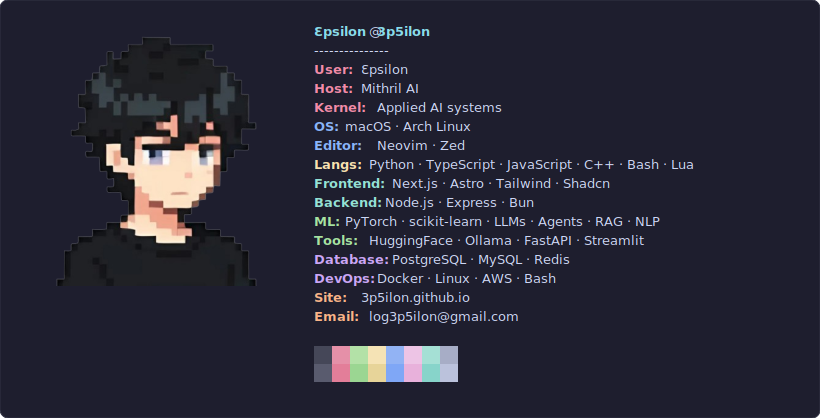

# ProfileFetch

A terminal fastfetch style SVG generator for your GitHub Profile readme.



## Quick Setup

1. Fork or use as template (repo name = your GitHub username)
2. Edit the source files in `src/` (see Customization below).
3. Generate your SVG with one command:

```bash
node src/generate.js
```

## 🛠️ Customization

### 📝 `src/config.js` - Content

#### `info` Array - Your Config

| Option                  | Description                                                      |
| ----------------------- | ---------------------------------------------------------------- |
| `{ key, value, color }` | Single stat line                                                 |
| `[ { ... }, { ... } ]`  | Nested array = auto adds a break between groups                  |
| `blankBetweenGroups`    | `true` / `false` - Auto-gap when colors differ within same group |

#### `logo` - Your Logo/Profile

| Mode         | Description                                                                     |
| ------------ | ------------------------------------------------------------------------------- |
| `logo.type`  | `"text"` or `"image"`                                                           |
| **Text Mode**| Logo file at `src/logo.txt` - adjust size with `logo.fontSize`                 |
| **Image Mode**| Image at `src/logo.png` (PNG/JPG → Base64) - customize with `width` & `height` |

**Example:**

```js
info: [
  // Group 1
  { key: "OS", value: "Arch Linux", color: "blue" },
  { key: "Shell", value: "zsh", color: "blue" },

  // Auto break here (nested array)

  // Group 2
  [
    { key: "Langs", value: "Python · TypeScript · C++ · Astro", color: "green" },
    { key: "ML", value: "PyTorch · Transformers · XGBoost", color: "green" },
  ],
],
```

### 🎨 Theme (`src/theme.js`)

| Option    | Description                                                                               |
| --------- | ----------------------------------------------------------------------------------------- |
| `palette` | Full hex control (currently [Catppuccin Mocha](https://github.com/catppuccin/catppuccin)) |
| `layout`  | `width`, `padding`, `columnGap`, `lineHeight`                                             |
| `font`    | Any Google Font (currently [JetBrains Mono](https://www.jetbrains.com/lp/mono/))          |

## 🖇️ Deployment

Add to `username/README.md` (repo must match your GitHub username)

```md
<div align="center">
  
</div>
```

## License

MIT
